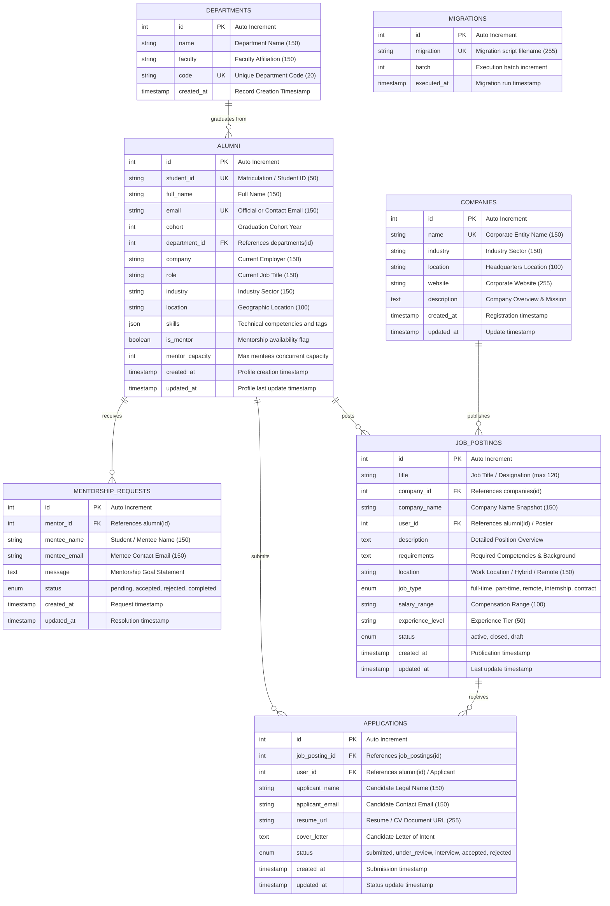

# Data Design Documentation (`ddd.md`)

> 🔗 **Bidirectional Navigation**: This document is linked to and from the primary system documentation.  
> [← Return to Main System Documentation (README.md)](./README.md)

---

## 1. Executive Data Architecture & Scope

**AlumniIstü** models graduate career mobilities, academic accreditations, and professional mentorship networks for the **Department of Management Information Systems (Yönetim Bilişim Sistemleri - YBS)** at **Istanbul University Faculty of Economics**.

This Data Design Document specifies the storage architecture, entity-relationship models, indexing strategies, persistence mechanisms, and disaster recovery invariants that govern the system.

---

## 2. Entity-Relationship Model (Mermaid ERD)


```mermaid
erDiagram
    DEPARTMENTS ||--o{ ALUMNI : "graduates from"
    ALUMNI ||--o{ MENTORSHIP_REQUESTS : "receives"
    COMPANIES ||--o{ JOB_POSTINGS : "publishes"
    ALUMNI ||--o{ JOB_POSTINGS : "posts"
    JOB_POSTINGS ||--o{ APPLICATIONS : "receives"
    ALUMNI ||--o{ APPLICATIONS : "submits"
    
    DEPARTMENTS {
        int id PK "Auto Increment"
        string name "Department Name (150)"
        string faculty "Faculty Affiliation (150)"
        string code UK "Unique Department Code (20)"
        timestamp created_at "Record Creation Timestamp"
    }

    ALUMNI {
        int id PK "Auto Increment"
        string student_id UK "Matriculation / Student ID (50)"
        string full_name "Full Name (150)"
        string email UK "Official or Contact Email (150)"
        int cohort "Graduation Cohort Year"
        int department_id FK "References departments(id)"
        string company "Current Employer (150)"
        string role "Current Job Title (150)"
        string industry "Industry Sector (150)"
        string location "Geographic Location (100)"
        json skills "Technical competencies and tags"
        boolean is_mentor "Mentorship availability flag"
        int mentor_capacity "Max mentees concurrent capacity"
        timestamp created_at "Profile creation timestamp"
        timestamp updated_at "Profile last update timestamp"
    }

    COMPANIES {
        int id PK "Auto Increment"
        string name UK "Corporate Entity Name (150)"
        string industry "Industry Sector (150)"
        string location "Headquarters Location (100)"
        string website "Corporate Website (255)"
        text description "Company Overview & Mission"
        timestamp created_at "Registration timestamp"
        timestamp updated_at "Update timestamp"
    }

    JOB_POSTINGS {
        int id PK "Auto Increment"
        string title "Job Title / Designation (max 120)"
        int company_id FK "References companies(id)"
        string company_name "Company Name Snapshot (150)"
        int user_id FK "References alumni(id) / Poster"
        text description "Detailed Position Overview"
        text requirements "Required Competencies & Background"
        string location "Work Location / Hybrid / Remote (150)"
        enum job_type "full-time, part-time, remote, internship, contract"
        string salary_range "Compensation Range (100)"
        string experience_level "Experience Tier (50)"
        enum status "active, closed, draft"
        timestamp created_at "Publication timestamp"
        timestamp updated_at "Last update timestamp"
    }

    APPLICATIONS {
        int id PK "Auto Increment"
        int job_posting_id FK "References job_postings(id)"
        int user_id FK "References alumni(id) / Applicant"
        string applicant_name "Candidate Legal Name (150)"
        string applicant_email "Candidate Contact Email (150)"
        string resume_url "Resume / CV Document URL (255)"
        text cover_letter "Candidate Letter of Intent"
        enum status "submitted, under_review, interview, accepted, rejected"
        timestamp created_at "Submission timestamp"
        timestamp updated_at "Status update timestamp"
    }

    MENTORSHIP_REQUESTS {
        int id PK "Auto Increment"
        int mentor_id FK "References alumni(id)"
        string mentee_name "Student / Mentee Name (150)"
        string mentee_email "Mentee Contact Email (150)"
        text message "Mentorship Goal Statement"
        enum status "pending, accepted, rejected, completed"
        timestamp created_at "Request timestamp"
        timestamp updated_at "Resolution timestamp"
    }

    MIGRATIONS {
        int id PK "Auto Increment"
        string migration UK "Migration script filename (255)"
        int batch "Execution batch increment"
        timestamp executed_at "Migration run timestamp"
    }
```

---

## 3. Physical Data Dictionary

### 3.1 Table: `departments`
Stores academic departments, faculties, and official codes.

| Column | Type | Constraints | Nullable | Default | Description |
| :--- | :--- | :--- | :--- | :--- | :--- |
| `id` | `INT` | `PRIMARY KEY AUTO_INCREMENT` | No | - | Unique department identifier |
| `name` | `VARCHAR(150)` | - | No | - | Full department name |
| `faculty` | `VARCHAR(150)` | - | No | - | Parent faculty name |
| `code` | `VARCHAR(20)` | `UNIQUE` | No | - | Department abbreviation code (e.g., `MIS-YBS`, `CENG`) |
| `created_at` | `TIMESTAMP` | - | No | `CURRENT_TIMESTAMP` | Initial registration timestamp |

---

### 3.2 Table: `alumni`
Core directory tracking graduate profiles, employment status, skillsets, and mentor quotas.

| Column | Type | Constraints | Nullable | Default | Description |
| :--- | :--- | :--- | :--- | :--- | :--- |
| `id` | `INT` | `PRIMARY KEY AUTO_INCREMENT` | No | - | Unique surrogate primary key |
| `student_id` | `VARCHAR(50)` | `UNIQUE` | No | - | University student matriculation number |
| `full_name` | `VARCHAR(150)` | - | No | - | Graduate legal name |
| `email` | `VARCHAR(150)` | `UNIQUE` | No | - | Validated contact email |
| `cohort` | `INT` | `INDEX (idx_cohort)` | No | - | Four-digit graduation year |
| `department_id` | `INT` | `FOREIGN KEY REFERENCES departments(id) ON DELETE SET NULL` | Yes | `NULL` | Associated academic department |
| `company` | `VARCHAR(150)` | - | Yes | `NULL` | Current corporate or institutional employer |
| `role` | `VARCHAR(150)` | - | Yes | `NULL` | Professional title or job role |
| `industry` | `VARCHAR(150)` | `INDEX (idx_industry)` | Yes | `NULL` | Primary industry sector |
| `location` | `VARCHAR(100)` | - | Yes | `NULL` | Primary city and country of residence |
| `skills` | `JSON` | - | Yes | `NULL` | Multi-tag list of technical competencies |
| `is_mentor` | `BOOLEAN` | `INDEX (idx_mentor)` | No | `FALSE` | Flag indicating mentorship willingness |
| `mentor_capacity`| `INT` | - | No | `0` | Active simultaneous mentee bandwidth limit |
| `created_at` | `TIMESTAMP` | - | No | `CURRENT_TIMESTAMP` | Profile creation timestamp |
| `updated_at` | `TIMESTAMP` | - | No | `CURRENT_TIMESTAMP ON UPDATE CURRENT_TIMESTAMP` | Automatic audit timestamp |

---

### 3.3 Table: `mentorship_requests`
Tracks incoming mentorship requests between current students/recent grads and senior mentors.

| Column | Type | Constraints | Nullable | Default | Description |
| :--- | :--- | :--- | :--- | :--- | :--- |
| `id` | `INT` | `PRIMARY KEY AUTO_INCREMENT` | No | - | Unique request identifier |
| `mentor_id` | `INT` | `FOREIGN KEY REFERENCES alumni(id) ON DELETE CASCADE` | No | - | Targeted mentor profile |
| `mentee_name` | `VARCHAR(150)` | - | No | - | Requesting student's name |
| `mentee_email`| `VARCHAR(150)` | - | No | - | Requesting student's contact email |
| `message` | `TEXT` | - | No | - | Statement of purpose and mentorship objectives |
| `status` | `ENUM` | `('pending', 'accepted', 'rejected', 'completed')` | No | `'pending'` | Lifecycle state of mentorship |
| `created_at` | `TIMESTAMP` | - | No | `CURRENT_TIMESTAMP` | Submission timestamp |
| `updated_at` | `TIMESTAMP` | - | No | `CURRENT_TIMESTAMP ON UPDATE CURRENT_TIMESTAMP` | Resolution timestamp |

---

### 3.4 Table: `migrations`
Internal schema versioning table managed by `database/migrate.php`.

| Column | Type | Constraints | Nullable | Default | Description |
| :--- | :--- | :--- | :--- | :--- | :--- |
| `id` | `INT` | `PRIMARY KEY AUTO_INCREMENT` | No | - | Migration execution sequence |
| `migration` | `VARCHAR(255)`| `UNIQUE` | No | - | Migration SQL file name |
| `batch` | `INT` | - | No | - | Batch sequence number |
| `executed_at`| `TIMESTAMP` | - | No | `CURRENT_TIMESTAMP` | Time migration was applied |

---

### 3.5 Table: `companies`
Corporate entities and enterprise employers hiring alumni and offering internships.

| Column | Type | Constraints | Nullable | Default | Description |
| :--- | :--- | :--- | :--- | :--- | :--- |
| `id` | `INT` | `PRIMARY KEY AUTO_INCREMENT` | No | - | Unique company identifier |
| `name` | `VARCHAR(150)` | `UNIQUE` | No | - | Official company / enterprise name |
| `industry` | `VARCHAR(150)` | `INDEX (idx_company_industry)` | Yes | `NULL` | Industry classification sector |
| `location` | `VARCHAR(100)` | - | Yes | `NULL` | Corporate headquarters or main branch |
| `website` | `VARCHAR(255)` | - | Yes | `NULL` | Company URL or career portal |
| `description` | `TEXT` | - | Yes | `NULL` | Corporate overview and profile |
| `created_at` | `TIMESTAMP` | - | No | `CURRENT_TIMESTAMP` | Company record creation timestamp |
| `updated_at` | `TIMESTAMP` | - | No | `CURRENT_TIMESTAMP ON UPDATE CURRENT_TIMESTAMP` | Last profile update timestamp |

---

### 3.6 Table: `job_postings`
Career opportunities, full-time roles, internships, and project contracts posted by companies or alumni.

| Column | Type | Constraints | Nullable | Default | Description |
| :--- | :--- | :--- | :--- | :--- | :--- |
| `id` | `INT` | `PRIMARY KEY AUTO_INCREMENT` | No | - | Unique job posting identifier |
| `title` | `VARCHAR(120)` | `Required, max 120 chars` | No | - | Position title (e.g. Lead Data Engineer) |
| `company_id` | `INT` | `FOREIGN KEY REFERENCES companies(id) ON DELETE SET NULL` | Yes | `NULL` | Associated hiring company |
| `company_name` | `VARCHAR(150)` | `Required` | No | - | Snapshot company name for display resilience |
| `user_id` | `INT` | `FOREIGN KEY REFERENCES alumni(id) ON DELETE SET NULL` | Yes | `NULL` | Alumni user who authored/published the post |
| `description` | `TEXT` | `Optional` | Yes | `NULL` | Comprehensive job description & duties |
| `requirements` | `TEXT` | `Optional` | Yes | `NULL` | Required qualifications, degrees, skills |
| `location` | `VARCHAR(150)` | `Optional` | Yes | `NULL` | Office location, City, Hybrid, or Remote |
| `job_type` | `ENUM` | `('full-time', 'part-time', 'remote', 'internship', 'contract')` | No | `'full-time'` | Employment contract modality |
| `salary_range` | `VARCHAR(100)` | `Optional` | Yes | `NULL` | Compensation range / salary band |
| `experience_level` | `VARCHAR(50)` | - | Yes | `'Mid-Level'` | Target seniority (Entry, Mid, Senior, Lead) |
| `status` | `ENUM` | `('active', 'closed', 'draft')` | No | `'active'` | Publication lifecycle state |
| `created_at` | `TIMESTAMP` | `INDEX (idx_job_created)` | No | `CURRENT_TIMESTAMP` | Publication timestamp |
| `updated_at` | `TIMESTAMP` | - | No | `CURRENT_TIMESTAMP ON UPDATE CURRENT_TIMESTAMP` | Last modification timestamp |

#### 3.6.1 Validation Rules & Domain Invariants (`JobPosting`)
As formally mandated by the backend architecture and classroom lecture requirements (Whiteboard Item 2 — Week 07):

| Field | Status | Constraint | Error Code | Error Message |
| :--- | :--- | :--- | :--- | :--- |
| `title` | **Required** | Non-empty string, max **120 characters** | `HTTP 422` | `"Validation error: 'title' is required."` / `"Validation error: 'title' must not exceed 120 characters."` |
| `Company` (`company` / `company_name`) | **Required** | Non-empty string or valid `company_id` reference | `HTTP 422` | `"Validation error: 'company' (or company_name) is required."` |
| `salary` (`salary` / `salary_range`) | **Optional** | May be omitted, empty, or `null` | — | — |
| `description` | **Optional** | May be omitted, empty, or `null` | — | — |
| `city` / `location` | **Optional** | May be omitted; defaults to `'Istanbul, Turkey'` | — | — |

**Detailed Specifications:**

- **`title`**:
  - **Status**: **Required**.
  - **Constraint**: String, **maximum 120 characters** (`1 <= mb_strlen(trim($title)) <= 120`).
  - **Error Behavior**: Requests omitting `title` or providing an empty/whitespace string return `HTTP 422 Unprocessable Entity` with message `"Validation error: 'title' is required."`. If `title` exceeds 120 characters, returns `HTTP 422 Unprocessable Entity` with message `"Validation error: 'title' must not exceed 120 characters."`.
  - **Implementation**: [`JobPostingApiController::validateJobPostingInput()`](./src/Controllers/JobPostingApiController.php)

- **`Company` (`company` / `company_name`)**:
  - **Status**: **Required**.
  - **Constraint**: Must be a non-empty string or refer to a valid `company_id`. Accepts `company`, `company_name`, or `company_id` interchangeably.
  - **Error Behavior**: Requests lacking all company fields return `HTTP 422 Unprocessable Entity` with message `"Validation error: 'company' (or company_name) is required."`.

- **`salary` (`salary` / `salary_range`)**:
  - **Status**: **Optional**.
  - **Constraint**: May be omitted, empty, or `null`. When provided, represents compensation band (e.g., `₺95,000 - ₺130,000 / month`).

- **`description`**:
  - **Status**: **Optional**.
  - **Constraint**: May be omitted, empty, or `null`. When provided, contains detailed responsibilities and role description.

- **`city` / `location`**:
  - **Status**: **Optional**.
  - **Constraint**: May be omitted or set to specific city / remote modality. Defaults to `'Istanbul, Turkey'` when unspecified.

---

### 3.7 Table: `applications`
Candidate job applications submitted by students and alumni for published job opportunities.

| Column | Type | Constraints | Nullable | Default | Description |
| :--- | :--- | :--- | :--- | :--- | :--- |
| `id` | `INT` | `PRIMARY KEY AUTO_INCREMENT` | No | - | Unique application identifier |
| `job_posting_id`| `INT` | `FOREIGN KEY REFERENCES job_postings(id) ON DELETE CASCADE` | No | - | Target job vacancy |
| `user_id` | `INT` | `FOREIGN KEY REFERENCES alumni(id) ON DELETE SET NULL` | Yes | `NULL` | Applying alumni/student profile (optional) |
| `applicant_name`| `VARCHAR(150)` | - | No | - | Candidate full legal name |
| `applicant_email`| `VARCHAR(150)` | - | No | - | Candidate contact email |
| `resume_url` | `VARCHAR(255)` | - | Yes | `NULL` | Link to candidate CV / portfolio document |
| `cover_letter` | `TEXT` | - | Yes | `NULL` | Candidate letter of intent / motivation |
| `status` | `ENUM` | `('submitted', 'under_review', 'interview', 'accepted', 'rejected')` | No | `'submitted'` | Application review workflow state |
| `created_at` | `TIMESTAMP` | `INDEX (idx_app_created)` | No | `CURRENT_TIMESTAMP` | Application submission timestamp |
| `updated_at` | `TIMESTAMP` | - | No | `CURRENT_TIMESTAMP ON UPDATE CURRENT_TIMESTAMP` | Last review status update timestamp |

---

## 4. Technical Storage & Engine Decisions

1. **Storage Engine: InnoDB**
   - **ACID Transactions**: Required to ensure atomic state updates across mentorship quotas, profile modifications, and migration transactions.
   - **Row-Level Locking**: High read/write throughput without blocking concurrent directory searches.
   - **Foreign Key Enforcement**: Guarantees referential integrity between `alumni` and `departments`.

2. **Character Set: `utf8mb4` with `utf8mb4_unicode_ci`**
   - Essential for flawless rendering and sorting of Turkish characters (`ç`, `ğ`, `ı`, `ö`, `ş`, `ü`, `Ç`, `Ğ`, `İ`, `Ö`, `Ş`, `Ü`) in student names, company titles, and department designations.

3. **Hybrid Schema: Relational + Native JSON**
   - High-cardinality metadata (cohorts, student IDs, department relationships) is stored in strict relational columns with explicit constraints.
   - Fluid skillsets (`skills`) are stored in MySQL native `JSON` columns, enabling flexible tag arrays without cumbersome junction tables, while maintaining indexing capabilities.

---

## 5. The Forgetting Test Protocol (Secret / Persistence Validation)

### 5.1 The Architectural Problem
By default, Docker container filesystems are ephemeral. Without an explicit persistent volume, executing:
```bash
docker compose down
docker compose up
```
destroys and recreates the container, causing MySQL to re-initialize its data directory and completely "forget" newly created records.

### 5.2 The Architectural Solution
AlumniIstü employs an isolated **Docker Named Volume** (`nexus_mysql_data`) mounted to the MySQL container storage root:

```yaml
services:
  db:
    volumes:
      - nexus_mysql_data:/var/lib/mysql

volumes:
  nexus_mysql_data:
    driver: local
```

Because named volumes are decoupled from container lifecycles:
1. `docker compose down` halts and removes containers, networks, and images, but leaves `nexus_mysql_data` untouched on the host filesystem.
2. `docker compose up` spins up fresh containers and re-attaches `nexus_mysql_data`, instantly recovering all accumulated rows, indexes, and transactions.

### 5.3 Automated Verification Protocol
To execute the automated forgetting test:
```bash
./tests/forgetting_test.sh
```

**Step-by-Step Verification Flow**:
```text
1. [CREATE]  POST /api/v1/alumni
             Payload: {"name": "Ada Lovelace", "email": "ada@cv.edu.tr", ...}
             Result: HTTP 201 Created (ID: #42)
             
2. [DOWN]    docker compose down
             Containers removed; persistent volume nexus_mysql_data preserved.
             
3. [UP]      docker compose up -d
             New containers launched; nexus_mysql_data remounted.
             
4. [CHECK]   GET /api/v1/alumni/42
             Result: HTTP 200 OK (Data intact)
             VERIFICATION: PASS ✔
```

---

## 6. Migration and Seeding Lifecycle

- **Migrations**: Executed via `php database/migrate.php [up|status|fresh]`.
- **Factory**: Generated via `AlumniIstü\Database\Factories\AlumniFactory`.
- **Seeder**: Seeded via `php database/seed.php [--count=20]`.

---

## 7. Middleware Architecture & Error Guardian System (Week 07)

AlumniIstü implements an enterprise-grade three-layer middleware pipeline enforced on every incoming HTTP request. All middleware classes reside in `src/Middleware/` and are registered via `public/index.php` before the router resolves.

### 7.1 Request Logger Middleware (`LoggerMiddleware`)

**File**: [`src/Middleware/LoggerMiddleware.php`](./src/Middleware/LoggerMiddleware.php)

Provides real-time HTTP telemetry output directly to the terminal (stdout + stderr) on every request lifecycle.

**Log Format:**
```
[time] [method] [route] [res.type] [duration]
```

**Example terminal row:**
```
12:20:30 Post /user 201 18 ms
10:20:30 Get /api/v1/alumni 200 5 ms
09:15:44 Delete /api/v1/job-postings/3 204 11 ms
```

**Implementation Details:**
- Registered via `LoggerMiddleware::start($method, $uri)` at the top of `public/index.php`.
- Uses `register_shutdown_function()` to guarantee log emission even when handlers call `exit;` (e.g., via `Response::json()`).
- Outputs simultaneously to `php://stdout`, `php://stderr`, and PHP `error_log()` for Docker container compatibility.
- Log buffer accessible via `LoggerMiddleware::getLogs()` for automated test assertions.

| Property | Value |
| :--- | :--- |
| **Output Target** | Terminal (stdout + stderr) |
| **Trigger** | Every HTTP request |
| **Shutdown Hook** | Yes — always logs even on early exit |
| **Test Accessible** | Yes — `LoggerMiddleware::getLogs()` |

---

### 7.2 404 Guardian Middleware (`NotFoundGuardianMiddleware`)

**File**: [`src/Middleware/NotFoundGuardianMiddleware.php`](./src/Middleware/NotFoundGuardianMiddleware.php)  
**Alias**: [`src/Middleware/Guardian404Middleware.php`](./src/Middleware/Guardian404Middleware.php)

Intercepts all unmatched routes and non-existent resource lookups, returning structured, human-readable 404 responses.

**API Response Format (JSON):**
```json
{
  "status": "error",
  "code": 404,
  "guardian": "404 Guardian Middleware",
  "message": "Resource or endpoint not found",
  "reason": "The requested endpoint 'GET /api/v1/unknown' does not exist on this server.",
  "method": "GET",
  "path": "/api/v1/unknown",
  "timestamp": "2026-11-11T12:00:00+03:00"
}
```

**Browser Response:** Renders `templates/404.html` dark-mode error template with diagnostic badges.

**Implementation Details:**
- Automatically invoked by the Router when no matching route is found.
- `NotFoundGuardianMiddleware::guard($method, $uri, $customReason)` can be called from any controller.
- `NotFoundGuardianMiddleware::abort($reason)` shortcut for inline 404 termination.
- Smart content negotiation: JSON for API requests (`/api/`), HTML for browser requests.

| Property | Value |
| :--- | :--- |
| **HTTP Status** | `404 Not Found` |
| **JSON Trigger** | Accept: `application/json` or path starts with `/api/` |
| **HTML Trigger** | Browser requests (renders `templates/404.html`) |
| **Custom Reason** | Yes — via `guard()` / `abort()` |

**Graceful Redirections (Generic 404 & Redirection):**

| Incoming URL | Redirect Target | Behavior |
| :--- | :--- | :--- |
| `/home` | `/` | `302 Redirect` |
| `/job` | `/jobs` | `302 Redirect` |
| `/job-postings` | `/jobs` | `302 Redirect` |
| `/application` | `/applications` | `302 Redirect` |
| Any unknown `/api/*` | — | `404 JSON response` |
| Any unknown browser URL | — | `404 HTML template` |

---

### 7.3 5xx Server Error Guardian (`ServerErrorGuardianMiddleware`)

**File**: [`src/Middleware/ServerErrorGuardianMiddleware.php`](./src/Middleware/ServerErrorGuardianMiddleware.php)  
**Alias**: [`src/Middleware/Guardian5xxMiddleware.php`](./src/Middleware/Guardian5xxMiddleware.php)

Intercepts all uncaught exceptions, runtime errors, and PHP fatal errors to prevent raw crash output and ensure clean 500 responses are always returned.

**API Response Format (JSON):**
```json
{
  "status": "error",
  "code": 500,
  "guardian": "5xx Guardian Middleware",
  "error": "Internal Server Error",
  "message": "An unexpected server error occurred.",
  "reason": "An internal execution error was intercepted safely by 5xx Guardian Middleware. Details logged to logs/error.logs.",
  "error_id": "err_671452c4",
  "path": "/api/v1/alumni",
  "method": "POST",
  "timestamp": "2026-11-11T12:00:00+03:00"
}
```

**Implementation Details:**
- `ServerErrorGuardianMiddleware::register()` is called at the very top of `public/index.php`, before any routing.
- Registers three PHP handlers: `set_exception_handler()`, `set_error_handler()`, and `register_shutdown_function()`.
- Never leaks environment secrets, database credentials, or internal file paths in public responses.
- Generates a unique `error_id` (e.g., `err_671452c4`) per incident for traceability.

| Property | Value |
| :--- | :--- |
| **HTTP Status** | `500 Internal Server Error` |
| **Handlers Registered** | Exception, Error, Shutdown (fatal) |
| **Log Destination** | `logs/error.logs` |
| **Error ID** | Unique hex token per incident |
| **Secret Leakage** | None — sanitized response only |

---

### 7.4 Error Logging to File (`logs/error.logs`)

**File**: `logs/error.logs`

The 5xx Guardian automatically ensures the `logs/` directory is created if absent, then appends structured incident records.

**Log Entry Format:**
```
[2026-11-11 12:00:00] [500] [ID:err_671452c4] [POST /api/v1/alumni]
Error: RuntimeException: Database connection refused
File: /var/www/html/src/Core/Database.php:42
Trace:
#0 /var/www/html/src/Models/Alumni.php(85): AlumniIstü\Core\Database::getConnection()
#1 /var/www/html/public/index.php(210): AlumniIstü\Controllers\AlumniApiController->create()
#2 {main}
--------------------------------------------------------------------------------
```

**Key Properties:**
- Directory auto-creation: `logs/` is created with `0777` permissions if it does not exist.
- File appended with `FILE_APPEND | LOCK_EX` for concurrent write safety.
- Also mirrors to Apache/PHP `error_log()` for Docker container log aggregation.
- Log file is excluded from version control via `.gitignore` (`.logs` pattern).

---

### 7.5 Middleware Registration & Execution Order

```
HTTP Request
     │
     ▼
┌─────────────────────────────────────────────────────┐
│  5xx Guardian (global exception/shutdown handlers)  │  ← registered first (ServerErrorGuardianMiddleware::register())
└──────────────────────────┬──────────────────────────┘
                           │
                           ▼
┌─────────────────────────────────────────────────────┐
│  Logger Middleware (start timer + shutdown hook)    │  ← LoggerMiddleware::start($method, $uri)
└──────────────────────────┬──────────────────────────┘
                           │
                           ▼
┌─────────────────────────────────────────────────────┐
│  Router::resolve() — dispatches matched route       │
│    └─ No match found → 404 Guardian                 │  ← NotFoundGuardianMiddleware::guard()
│    └─ Exception thrown → 5xx Guardian               │  ← ServerErrorGuardianMiddleware::handleException()
└──────────────────────────┬──────────────────────────┘
                           │
                           ▼
┌─────────────────────────────────────────────────────┐
│  Shutdown Hook fires — Logger emits terminal line   │  ← [time] [method] [route] [status] [duration]
└─────────────────────────────────────────────────────┘
```

---

[← Return to Main System Documentation (README.md)](./README.md)
